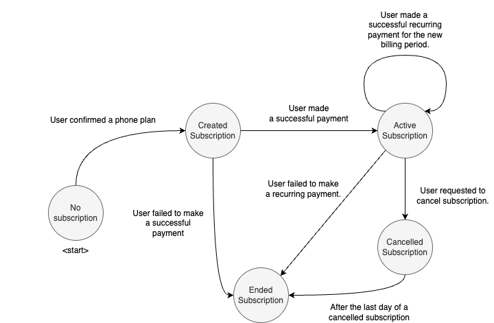

# Gigs Analytics Engineering Challenge
As part of the interview process we are looking to assess your data modelling skills. Hence, we ask you to do two things:
1. Solve the challenge below. The work should be timeboxed to around 4 hours.
2. Create a short document, explaining how you solved the challenge and how the structure that you picked for your dbt project is able to scale for a fast growing startup.

## Problem statement
**Disclaimer: The challenge we are posing here is similar to a real-life scenario the Gigs data team had to solve previously. We are keen to see how you think about that problem.**
> We will never use the code you provide for anything outside of the interview process!

Gigs, a Telecom-as-a-Service provider, empowers businesses to offer their own mobile phone plans to their users. Users of Gigs's customers have the flexibility to choose a plan tailored their data and voice needs. Once they have confirmed their choice, Gigs initiates the creation of a subscription for that plan. A subscription becomes active upon succesful payment. The term of each subscription is determined by the selected plan and the specific requirements of the customer — for instance, a user might opt for a plan that renews monthly. Moreover, users have the autonomy to terminate their subscription; such requests result in the conclusion of the service at the end of the current billing cycle. Should a renewal payment be unsuccessful, the subscription is automatically terminated.

Now, imagine you've become a part of the Data Team at Gigs. The Finance Team has reached out for assistance. They're keen on analyzing [Monthly Recurring Revenues (MRR)](https://en.wikipedia.org/wiki/Revenue_stream#Recurring_revenue), a critical metric for assessing the company's financial health. As the Analytics Engineer, you are asked to build a flexible data model, using dbt, that allows the finance team to easily answer a number of questions around MRR. For this, you have access to the following datasets:

- **Subscriptions**: Contains the timestamp information of the lifecycle of a subscription (see the *Subscription Lifecycle* section below).
- **Subscription order events**: This dataset captures and logs each event when a subscription is initiated or renewed, along with the associated financial transaction amount in USD.
- **Plan events**: Contains data related to various mobile phone plan events.
- **Projects**: A customer of Gigs can create multiple projects (e.g. dev, test, prod). However, for this exercise you can assume each customer only has one project.

If you need to make trade-offs, shortcuts or make some assumptions please feel free to do so and document those. 

## Getting started
This repository contains a basic dbt project along with sample data (see the `seeds` folder) for you to get started. This challenge should
mainly be solved with dbt. In the instructions below, we show you how to get started with the dbt project using duckdb, though you
are free to use a different database engine as well.

To set up the project locally, follow the these steps:
1. Clone this repository and navigate to its folder.
2. Install duckdb, dbt-core and dbt-duckdb (you might want to use something like [virtualenv](https://virtualenv.pypa.io/en/latest/) or similar):
   `pip install duckdb==0.9.1 dbt-core==1.6.2 dbt-duckdb==1.6.2`
3. Point the `DBT_PROFILES_DIR` environment variable to this directory (or update your own `~/.dbt/profiles.yml` configuration).:
   `export DBT_PROFILES_DIR=$PWD`
4. You are now ready to go!

## Description of the provided datasets

### `subscription_order_events`

| Column                              | Description                                            |
|-------------------------------------|--------------------------------------------------------|
| `event_id`                          | Event identifier                                       |
| `event_type`                        | Event type (subscription.renewed or subscription.created)|
| `event_timestamp`                   | Timestamp when the order was created                   |
| `project_id`                        | Project identifier (a project is a customer)           |
| `subscription_id`                   | Subscription Identifier                                |
| `plan_id`                           | Plan ID of the subscription                            |
| `subscription_period_start`         | Subscription period start datetime                     |
| `subscription_period_end`           | Subscription period end datetime                       |
| `total_subscription_booking_amount_usd` | Total bookings in USD (before payouts)              |

### `subscriptions`

| Column                        | Description                                     |
|-------------------------------|-------------------------------------------------|
| `subscription_id`             | Unique identifier of the subscription.         |
| `subscription_created_at`     | Time when the subscription was created.        |
| `subscription_activated_at`   | Time when the subscription was activated.      |
| `subscription_canceled_at`    | Time when the subscription was canceled.       |
| `subscription_ended_at`       | Time when the subscription was ended.          |

### `plan_events`

| Column                | Description                                       |
|-----------------------|---------------------------------------------------|
| `event_id`            | Unique row identifier                             |
| `event_type`          | Event type (e.g. plan.created)                    |
| `event_timestamp`     | Timestamp when the plan event was emitted         |
| `plan_id`             | Unique plan identifier                            |
| `validity_unit`       | Plan duration unit (day or month)                 |
| `validity_duration`   | Plan duration length                              |
| `plan_status`         | Plan status                                       |
| `_valid_from`         | Event valid from timestamp                        |
| `_valid_to`           | Event valid to timestamp                          |
| `_is_current_state`   | Most recent plan event                            |

### `projects`

| Column                  | Description                                          |
|-------------------------|------------------------------------------------------|
| `project_id`            | Unique project identifier                            |
| `project_created_at`    | Timestamp the project was created                    |
| `payment_mode`          | Project payment mode if enabled                      |
| `is_customer`           | Is this project a customer owned project?            |

## Lifecyle of a subscription

## Assessment
Once you have completed the assignment, you can send a copy of your work to `analytics-engineering-challenge at gigs.com` or share a repository with:

[@ccbrandenburg](https://www.github.com/ccbrandenburg)

[@bramrodenburg](https://www.github.com/bramrodenburg)

[@Mick1406](https://www.github.com/Mick1406)

Your solution will be assessed on:
- attention to detail
- creativity
- code readability
- data model
- documentation
- efficiency

## Relevant links

- [Gigs Developer Documentation](https://developers.gigs.com/)
